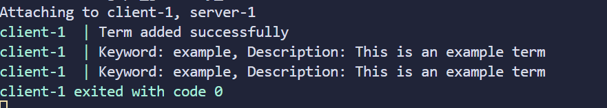

## Установка
1. Клонируйте репозиторий:
   ```cd grpc_glossary_service```

## Запуск контейнера
```docker-compose up --build
```

## Результаты работы клиента: После запуска клиент выполняет запросы:
# grpc_glossary_service
